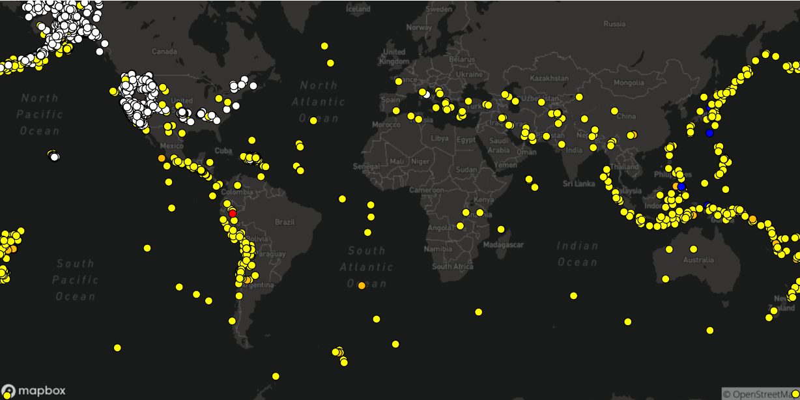

# MappingData

<h3>
  Visualizing data set of all earthquakes in 30 days each colour refers to a magnitude scale 
</h3>

  

  Mapping data to a map using <b>p5.js</b>
 
 Data used : <link>https://earthquake.usgs.gov/earthquakes/feed/v1.0/csv.php</link> 

 

  Formula used to convert <b>longtitude</b> and <b>latitude</b> to <b>X</b> and <b>Y</b> values

  <link>https://en.wikipedia.org/wiki/Web_Mercator_projection</link>

